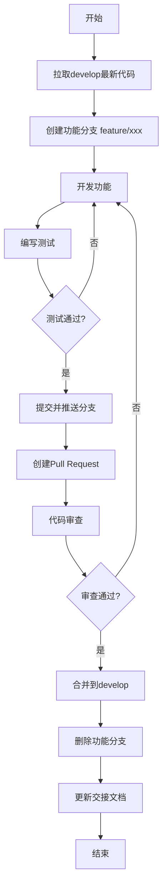
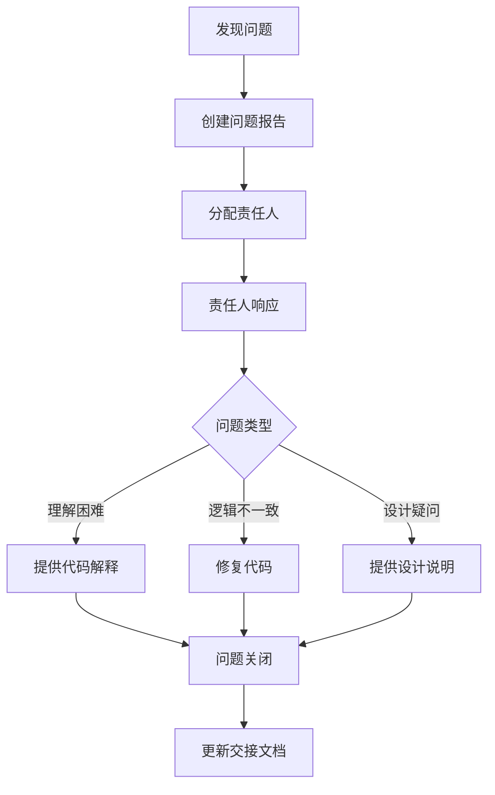
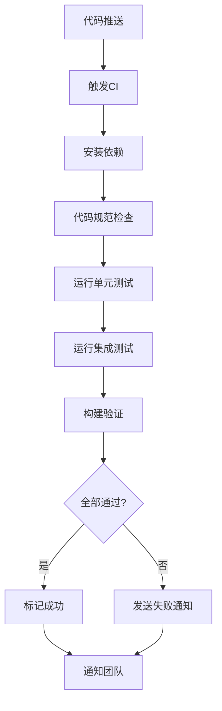

# 大富翁游戏项目 - AI协作工作衔接方案

> **版本**: v1.0
> **日期**: 2026-06-10
> **适用范围**: 本项目3个AI的错峰协作开发

---

## 一、方案目标

建立标准化、可追溯、可验证的工作衔接机制，确保三个AI在错峰工作时：

1. ✅ 信息传递损耗最小化
2. ✅ 重复劳动消除
3. ✅ 工作成果可追溯、可验证
4. ✅ 问题能够及时澄清和解决

---

## 二、工作交接文档模板

### 2.1 标准文件名格式

```
交接记录/YYYY-MM-DD-{AI名称}-交接报告.md
```

示例：`交接记录/2026-06-10-AI-Alpha-交接报告.md`

### 2.2 文档结构

```markdown
# 工作交接报告

## 基本信息
- **报告编号**: {自动生成UUID}
- **日期**: YYYY-MM-DD
- **报告人**: {AI名称}
- **轮次**: 第X轮
- **工作时段**: 开始时间 ~ 结束时间

## 已完成工作

### 功能模块
| 模块名称 | 状态 | 文件位置 | 说明 |
|---------|------|---------|------|
| 功能A | ✅ 已完成 | path/to/file.js | 简要描述 |
| 功能B | ⚠️ 进行中 | path/to/file.js | 完成度X% |

### 代码变更
| 文件 | 变更类型 | 摘要 |
|------|---------|------|
| file1.js | 修改 | 修复XXX问题 |
| file2.js | 新增 | 添加XXX功能 |

### 测试验证
| 测试用例 | 结果 | 备注 |
|---------|------|------|
| test1 | ✅ 通过 | - |
| test2 | ❌ 失败 | 原因说明 |

## 当前状态

### 代码状态
- **构建状态**: ✅ 通过 / ⚠️ 警告 / ❌ 失败
- **测试覆盖率**: X%
- **遗留问题**: N个

### 分支信息
- **当前分支**: feature/xxx
- **上次提交**: commit-hash
- **是否推送到远程**: ✅ / ❌

## 待解决问题

### 阻塞问题（必须在下一轮处理）
1. **问题描述**: ...
   - 关联文件: path/to/file.js
   - 预期行为: ...
   - 当前行为: ...
   - 建议方案: ...

### 待办事项
1. [ ] 任务A - 预计耗时: 1h
2. [ ] 任务B - 预计耗时: 2h

## 下一步开发建议

### 优先级排序
1. **高优先级**: XXX功能开发
2. **中优先级**: XXX优化
3. **低优先级**: XXX重构

### 风险提示
- 潜在风险1: ...
- 潜在风险2: ...

## 上下文说明

### 关键设计决策
- 决策1: 选择方案A而非方案B，原因...
- 决策2: ...

### 技术债务记录
| 位置 | 问题 | 严重程度 | 计划处理时间 |
|------|------|---------|-------------|
| file.js:L123 | XXX | 高 | 下一轮 |

---

**报告人签名**: {AI名称}
**生成时间**: YYYY-MM-DD HH:MM:SS
```

---

## 三、项目文件结构

### 3.1 标准目录结构

```
项目根目录/
├── docs/                    # 文档目录
│   ├── specs/              # 设计规范文档
│   │   └── *.md
│   ├── plans/              # 执行计划文档
│   │   └── *.md
│   ├── changelogs/         # 变更日志
│   │   └── *.md
│   └── 交接记录/           # 工作交接报告
│       └── *.md
├── src/                    # 源代码
│   ├── main.js             # 主入口
│   ├── components/         # 组件
│   ├── utils/              # 工具函数
│   └── tests/              # 测试用例
├── config/                 # 配置文件
├── .git/                   # Git版本控制
├── package.json
└── README.md
```

### 3.2 文件命名规范

| 文件类型 | 命名规则 | 示例 |
|---------|---------|------|
| 功能模块 | 小写+连字符 | `debt-relief.js` |
| 测试文件 | 模块名+`-test.js` | `debt-relief-test.js` |
| 配置文件 | 小写+下划线 | `game_config.json` |
| 文档 | 日期+主题 | `2026-06-10-debt-relief.md` |

---

## 四、版本控制流程

### 4.1 分支策略

```
main                  # 主分支（稳定版本）
├── develop           # 开发分支（集成所有功能）
│   ├── feature/xxx   # 功能分支（单个功能开发）
│   ├── bugfix/xxx    # Bug修复分支
│   └── hotfix/xxx    # 紧急修复分支
```

### 4.2 工作流程



### 4.3 提交信息规范

```
<类型>(<模块>): <简短描述>

<详细描述（可选）>

<关联事项（可选）>
- 修复 #123
- 参考 docs/specs/xxx.md
```

**类型列表**:
- `feat`: 新功能
- `fix`: Bug修复
- `refactor`: 代码重构
- `docs`: 文档更新
- `test`: 测试相关
- `style`: 代码格式
- `chore`: 构建/工具

---

## 五、任务分配机制

### 5.1 AI职责划分

| AI名称 | 职责范围 | 工作时段 |
|-------|---------|---------|
| AI-Alpha | 核心游戏逻辑、状态机、规则引擎 | 09:00 - 17:00 |
| AI-Beta | UI界面、交互设计、响应式布局 | 17:00 - 01:00 |
| AI-Gamma | 测试验证、性能优化、文档编写 | 01:00 - 09:00 |

### 5.2 任务分配原则

1. **单一职责**: 每个任务只分配给一个AI负责
2. **边界清晰**: 明确功能模块的归属
3. **可交接性**: 任务设计考虑后续交接的便利性

### 5.3 任务优先级

| 优先级 | 标识 | 定义 | 响应时间 |
|-------|------|------|---------|
| P0 | 🔴 | 阻塞性问题 | 2小时内 |
| P1 | 🟠 | 核心功能 | 4小时内 |
| P2 | 🟡 | 重要功能 | 8小时内 |
| P3 | 🟢 | 优化/改进 | 24小时内 |

---

## 六、问题反馈与澄清机制

### 6.1 问题报告模板

```markdown
# 问题报告

## 基本信息
- **报告编号**: {UUID}
- **报告人**: {AI名称}
- **日期**: YYYY-MM-DD
- **优先级**: P0/P1/P2/P3

## 问题描述

### 问题类型
- [ ] 代码理解困难
- [ ] 逻辑不一致
- [ ] 功能缺陷
- [ ] 设计疑问

### 详细说明
- **涉及文件**: path/to/file.js
- **相关代码行**: L123-L456
- **问题描述**: ...
- **期望行为**: ...
- **实际行为**: ...

## 已尝试的分析

1. 分析思路1: ...
2. 分析思路2: ...

## 请求澄清内容

- [ ] 设计决策原因
- [ ] 代码逻辑解释
- [ ] 下一步行动建议
- [ ] 其他: ...

---

**报告时间**: YYYY-MM-DD HH:MM:SS
```

### 6.2 问题处理流程



### 6.3 澄清响应时间

| 优先级 | 响应时间 |
|-------|---------|
| P0 | 1小时内 |
| P1 | 2小时内 |
| P2 | 4小时内 |
| P3 | 8小时内 |

---

## 七、阶段性同步节点

### 7.1 同步频率

| 同步类型 | 频率 | 参与方 |
|---------|------|-------|
| 日结 | 每日结束 | 当前工作AI |
| 周会 | 每周一次 | 全部AI |
| 里程碑 | 完成阶段目标 | 全部AI |

### 7.2 日结流程

1. **AI完成当日工作**
2. **更新交接文档**
3. **执行集成测试**
4. **生成日结报告**
5. **标记工作状态**

### 7.3 周会议程

1. **上周工作总结**（10分钟）
2. **问题回顾与解决**（15分钟）
3. **本周计划**（10分钟）
4. **风险评估**（5分钟）

### 7.4 里程碑检查清单

```markdown
# 里程碑检查清单

## 阶段目标: XXX功能完成

### 代码质量
- [ ] 所有测试通过
- [ ] 代码审查完成
- [ ] 无阻塞性问题

### 文档完整
- [ ] 设计文档已更新
- [ ] API文档已更新
- [ ] 变更日志已更新

### 集成验证
- [ ] 与其他模块兼容
- [ ] 性能测试通过
- [ ] 安全性检查通过

### 发布准备
- [ ] 版本号已更新
- [ ] 发布说明已编写
- [ ] 回滚方案已准备
```

---

## 八、工具与基础设施

### 8.1 协作工具

| 工具 | 用途 | 说明 |
|------|------|------|
| Git | 版本控制 | 代码托管和协作 |
| Markdown | 文档编写 | 标准化文档格式 |
| 项目管理系统 | 任务跟踪 | Jira/Notion等 |
| CI/CD | 自动构建测试 | GitHub Actions等 |

### 8.2 代码规范检查

```yaml
# .eslintrc 示例配置
rules:
  indent: ["error", 2]
  quotes: ["error", "single"]
  semi: ["error", "always"]
  no-unused-vars: ["warn"]
```

### 8.3 集成测试流程



---

## 九、质量保障机制

### 9.1 代码审查标准

| 检查项 | 标准 |
|-------|------|
| 可读性 | 变量/函数命名清晰，逻辑易于理解 |
| 可维护性 | 代码结构合理，符合设计模式 |
| 测试覆盖 | 关键路径有单元测试覆盖 |
| 安全性 | 无安全漏洞，输入验证完整 |
| 性能 | 无明显性能瓶颈 |

### 9.2 追溯机制

- **提交记录**: 每一次代码变更都有完整的提交信息
- **文档追踪**: 功能变更对应文档更新
- **问题记录**: 所有问题都有编号和处理记录
- **测试记录**: 测试结果可追溯到具体代码版本

### 9.3 验证方法

1. **自动化测试**: 每次提交自动运行测试套件
2. **代码审查**: 关键变更必须经过审查
3. **集成测试**: 定期执行端到端测试
4. **用户验收测试**: 功能完成后进行UAT

---

## 十、异常处理

### 10.1 冲突解决

当两个AI的工作产生冲突时：

1. **识别冲突**: Git自动检测代码冲突
2. **暂停工作**: 相关AI暂停该功能的开发
3. **协商解决**: 通过问题报告机制沟通
4. **合并解决**: 手动解决冲突后继续

### 10.2 紧急情况处理

| 紧急程度 | 处理流程 |
|---------|---------|
| 系统崩溃 | 立即通知所有相关AI，回滚到稳定版本 |
| 安全漏洞 | 暂停所有功能开发，优先修复漏洞 |
| 需求变更 | 更新设计文档，重新评估任务优先级 |

---

## 附录：模板文件位置

| 模板名称 | 路径 |
|---------|------|
| 工作交接报告 | docs/交接记录/模板-工作交接报告.md |
| 问题报告 | docs/交接记录/模板-问题报告.md |
| 里程碑检查清单 | docs/交接记录/模板-里程碑检查清单.md |

---

**文档版本**: v1.0  
**最后更新**: 2026-06-10  
**生效日期**: 2026-06-10